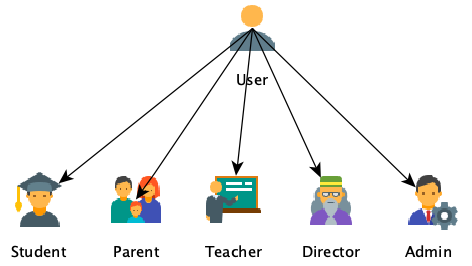
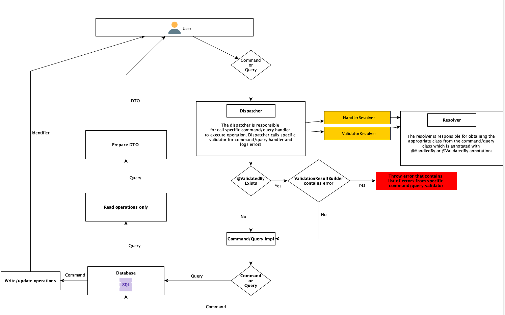

# e-Dziennik

_____________

    School managment application (Backend)
     
    Note this project is still in develop state
     
     
    <a href="https://github.com/SaQie/e-Dziennik-desktop"><strong>Move to client »</strong></a>
     
    <a href="https://github.com/SaQie/e-Dziennik/issues"><strike>Explore the docs</strike></a>
    .
    <a href="https://github.com/SaQie/e-Dziennik/issues"><strong>Report Bug »</strong></a>
    .
    <a href="https://github.com/SaQie/e-Dziennik/issues"><strong>Request Feature » </strong></a>
  

    <h3>About project </h3>

_____________

    This project is a backend server for <a href="https://github.com/SaQie/e-Dziennik-desktop"><b>client</b></a> that consume REST API for receiving a data. That is a full school managment application that allows you to do this kind of operations at the moment (02.05.2023)

| Description                   |                                            |
|-------------------------------|--------------------------------------------|
| **CRUD schools**              |      |
| **CRUD school classes**       |         |
| **CRUD students**             |         |
| **CRUD teachers**             |              |
| **CRUD parents**              |               |
| **CRUD admins**               |  |
| **CRUD subjects**             |                 |
| **CRUD grades**               |              |
| **Dynamic app configuration** |             |

Dynamic app configuration allows to configure our application through REST-API

Actually project is just a base project for future develop

#### Roles in application:

# ✉️ To do

_________

List of task's I will implements in future in this project:

* *Add email confirmation* ❌
* *Add redis cache for configuration* ❌
* *Add real time client-server chat (student-teacher)* ❌
* *Add email system inside application* ❌
* *Add exports student grades to PDF* ❌
* *Add homeworks that can be sent to teacher* ❌
* *Add notes system per student inside application* ❌
* *Add dashboard that shows recently added grades* ❌
* *Add interactive panel that allows to run groovy script and get result(for homeworks)* ❌
* *And more.....*

# 🪨 Milestones
___

- *(15/09/2022) Start project*
  - When I started the project, I decided to implement DAO pattern instead of Repository pattern
- *(21/12/2022)* Start client desktop project for this app     <a href="https://github.com/SaQie/e-Dziennik-desktop"><strong>Move to client »</strong></a>
- *(24/03/2023) Change persistence layer to Spring Data Jpa repositories*
  - I decided to change my persistence layer, due to i had a lot of problems with DAO pattern (Pagination, transactions etc.)
- *(06/05/2023) Changed architecture layer to CQRS, check <strong>[Architecture Look »](#-architecture-look)</strong>*

# 👨‍💻 Tech stack

_____

*Tech stack I actually using in this project*:

* Java 17
* Spring Boot 3.0.5
* Spring Data JPA
* Spring Security (JWT)
* Mockito
* JUnit
* Lombok
* Liquibase
* Swagger
* PostgreSQL
* Docker
* Maven
* GitHub with GitHub Workflows

# 🗾 Architecture look
___

*I am currently using CQRS architecture in my project.*
*Architecture look is available in a picture below:*

#  🖥️ How to run

_____
Project has a docker-compose file that allows to run application very simple:

* Firstly, install Docker <a href="https://docs.docker.com/desktop/install/windows-install/">Here</a>
* Copy this repository, run command line and type:   <code> git clone https://github.com/SaQie/e-Dziennik </code>
* Make sure that in application.properties file this line is not commented:  <code>url: jdbc:postgresql://postgres:
  5432/diary_db -- for docker</code>
    Or if you want you can run this application manually, but you will need install postgres on your computer and set
  up project manually
* Now, you can run this command that will build the docker containers and start them:
    <code>docker-compose up</code>
* End.

# 📄 Documentation

____

Project documentation is available on : */swagger-ui/index.html*
