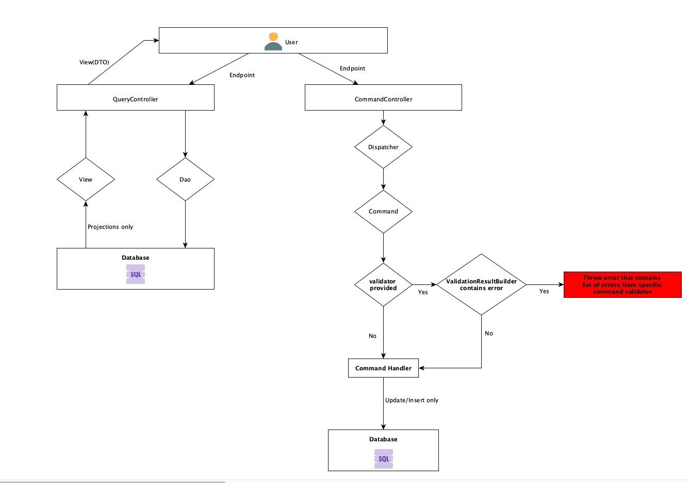
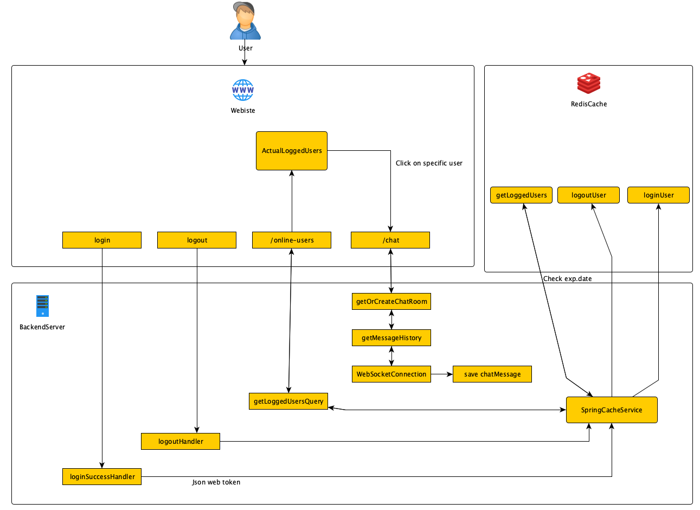
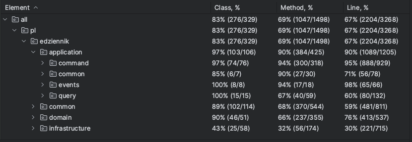

# e-Dziennik

_____________

    School managment application (Backend)
     
    Note this project is still in develop state
     
     
    <a href="https://github.com/SaQie/e-Dziennik-desktop"><strong>Move to client (D) » </strong></a>     <a href="https://github.com/SaQie/"><strong>Move to client (W) »</strong></a>
     
    <a href="https://github.com/SaQie/e-Dziennik/issues"><strike>Explore the docs</strike></a>
    .
    <a href="https://github.com/SaQie/e-Dziennik/issues"><strong>Report Bug »</strong></a>
    .
    <a href="https://github.com/SaQie/e-Dziennik/issues"><strong>Request Feature » </strong></a>
  

# 📰 Table of Contents

- <strong>[About project »](#ℹ-about-project)</strong>
- <strong>[Todo »](#-to-do)</strong>
- <strong>[Milestones »](#-milestones)</strong>
- <strong>[Tech-Stack »](#-tech-stack)</strong>
- <strong>[Architecture look »](#-architecture-look)</strong>
- <strong>[Chat - how it works »](#-chat---how-it-works)</strong>
- <strong>[How to run »](#-how-to-run)</strong>
- <strong>[Documentation »](#-documentation)</strong>
- <strong>[Test coverage »](#-test-coverage)</strong>

# ℹ️ About project

_____________

    This project is a backend server for <a href="https://github.com/SaQie/e-Dziennik-desktop"><b>client(D)</b></a> <a href="https://github.com/SaQie/"><b>client(W)</b></a> that consume REST API for receiving a data. That is a full school managment application that allows you to do this kind of operations at the moment

| Description                   |                                            | Description                 |                                       |
|-------------------------------|--------------------------------------------|-----------------------------|---------------------------------------|
| **Schools option**            |      | **Email confirmation**      |        |
| **School classes option**     |         | **Document generator**      |             |
| **Students option**           |         | **Internationalization**    |  |
| **Teachers option**           |              | **Real-Time Chat**          |          |
| **Parents option**            |               | **Groovy script Execution** |       |
| **Admins option**             |  | **Schedules**               |        |
| **Subjects option**           |                 |                             |                                       |
| **Grades option**             |              |                             |                                       |
| **Dynamic app configuration** |             |                             |                                       |

Dynamic app configuration allows to configure our application through REST-API

Actually project is just a base project for future develop

#### Roles in application:

# ✉️ To do

_________

List of tasks I will implement in future in this project:

* *Add email confirmation* ✅
* *Add redis cache for configuration* ✅
* *Add real time client-server chat (student-teacher)* ✅
* *Add email system inside application* ❌
* *Add exports student grades to PDF* ✅
* *Add homeworks that can be sent to teacher* ❌
* *Add notes system per student inside application* ❌
* *Add dashboard that shows recently added grades* ❌
* *Add interactive panel that allows to run groovy script and get result* ✅
* *And more.....*

# 🪨 Milestones

___

- *(15/09/2022) Start project*
    - When I started the project, I decided to implement DAO pattern instead of Repository pattern
- *(21/12/2022)* Start client desktop project for this
  app     <a href="https://github.com/SaQie/e-Dziennik-desktop"><strong>Move to client »</strong></a>
- *(24/03/2023) Change persistence layer to Spring Data Jpa repositories*
    - I decided to change my persistence layer, due to i had a lot of problems with DAO pattern (Pagination,
      transactions etc.)
- *(06/05/2023) Changed architecture layer to CQRS, check <strong>[Architecture Look »](#-architecture-look)</strong>*
- *(31/05/2023)* I decided to temporarily stop developing client desktop application and instead start developing
  Angular web client
- *(30/07/2023)* My first face to WebSocket's - implemented a new one-to-one chat with message history |
  check <strong>[Chat »](#-chat---how-it-works)</strong>
- *(14/09/2023)* I decided to delete IQuery and query classes, I came to conclusion, that better idea is to call
  directly dao from controller, I didn't see any advantages to keeping IQuery and moving every call through Dispatcher,
  check <strong>[Architecture Look »](#-architecture-look)</strong>
  where are two looks of architecture, the old one and a new one.

# 👨‍💻 Tech stack

_____

*Tech stack I actually using in this project*:

* Java 17
* Spring Boot 3.0.5
* Spring Data JPA
* Spring Security (JWT)
* Mockito
* JUnit
* Lombok
* Liquibase
* Swagger
* PostgreSQL
* Docker
* Maven
* GitHub with GitHub Workflows
* TestContainers
* Redis
* WebSockets
* Groovy

# 🗾 Architecture look

___

*I am currently using CQRS architecture in my project.*
*Architecture look is available in a picture below:*

**NEW architecture:**

**OLD architecture:**

# 💬 Chat - How it works

___

# 🖥️ How to run

_____
Project has a docker-compose file that allows to run application very simple:

* Firstly, install Docker <a href="https://docs.docker.com/desktop/install/windows-install/">Here</a>
* Copy this repository, run command line and type:   <code> git clone https://github.com/SaQie/e-Dziennik </code>
* Make sure that in application.properties file this line is not commented:  <code>url: jdbc:postgresql://postgres:
  5432/diary_db -- for docker</code>
    Or if you want you can run this application manually, but you will need install postgres on your computer and set
  up project manually
* Now, you can run this command that will build the docker containers and start them:
    <code>docker-compose up</code>
* End.

# 📄 Documentation

____

Project documentation is available on : */swagger-ui/index.html*

# 🧪 Test coverage

**(14/09/2023)** => Project contains over 200 tests (unit and integration)

